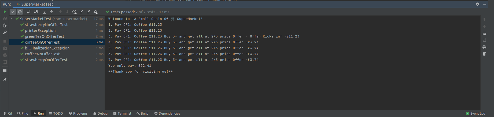

# SuperMarkets

## Getting started

To get started install the following

* JDK 8+
* maven
* Intellij Idea (optional)

Then,

```shell
$ mvn -e clean install
$ mvn -e test
```

or run it in your favourite IDE


## FAQ

### Why did you implement your own Billing Observer?

This is a demonstration of how an observer can be used to take this framework to next level. This approach introduces
the ability to extend further rules in the future. Offers can match multiple rules and Engine can choose one over the
other based on the priority of Rules with this pattern.

### How would I extend the framework to add Date Based (Bill Level) Discount for whole bill

The current question applies only item based rules, bill level based rules such as 10% off on Christmas day on the whole
bill can be applied very easily upon finalization of the bill.

### How would I extend the framework to detect Conflicting Rules e.g. 3 strawberries for $15 & 6 strabberies for $25

Conflicting rules must be driven from outside the individual rules; The best place to do it is while
registering/subscribing the rules.

### What about following scenario?

```
Basket: GR1,SR1,GR1,GR1,CF1
Total price expected: £22.45
```

This is probably a way to see it. Ideally for 3 green teas customer gets 3 green teas free. However this one looks to me
like it becomes customers responsibility to claim his freebies. This isn't best of customer experience, however if this
is to be implemented this way it's as simple as deferring the calculation of the freebies until after the finalization.
I am happy to implement this way if need be.

### What if I need a DB?

Simple, the Product class will be loaded from a datastore while a DAO, also the instances of offer table will be created
from rows in the database. In short the offers are always loaded from database and add and remove rows in database to
load offers dynamically. It can even be date driven, e.g. apply this offer from 31 Oct to 5 Nov, this can be as simple
as a one liner in the match method of rules.

### How frequently CEO & COO change their minds?

Easy Peasy, make it database driven and 2 ways to control either via subscription or via matches method in the rules.
Similar to what's in the testcases. Now the CEO and COO can afford to change their minds anytime, for, they already have
me as the lead programmer, You should probably do the same ;) .

